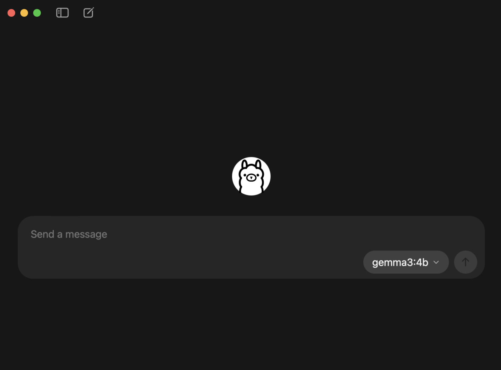
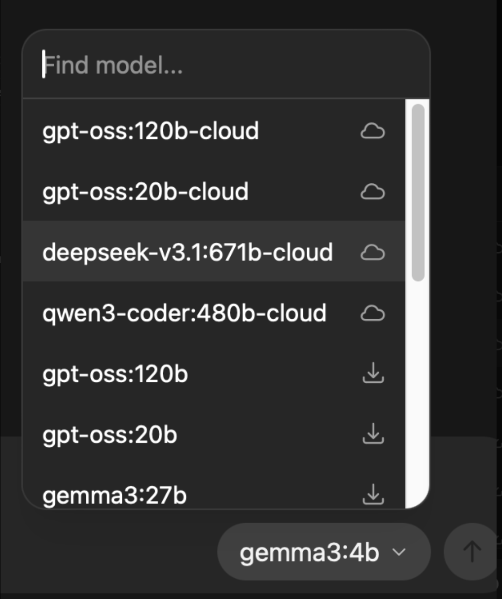

## Ollama 란
- 로컬 환경에서 LLM을 실행하고 관리할 수 있게 해주는 툴이다. 
- 굳이 클라우드에 요청을 보내지 않고도 내부 서버에서 LLM을 구동하게 함.
    - 대부분의 상용 AI 모델 (ChatGPT, Claude, Gemini 등)은 클라우드 API를 통해서만 사용 가능
    - API 호출이 많아질수록 과금 커짐, 개인 데이터 외부 서버로 전송됨, 모델 버전/설정/파라미터 직접 제어 어려움 등의 문제가 있다
- Ollama를 사용하면 LLM 모델을 다운로드하여 내 컴퓨터에서 제한 없이 직접 실행 가능하다 (GPU/CPU 필요)

## Continue 란 
- 기존 개발 방식의 한계: 개발자들이 ChatGPT, Cladue 등을 쓸 떄 흔히 겪는 패턴은 다음과 같다:
    1. Jetbrains 또는 VS Code에서 코드 작성
    2. 브라우저 열고 ChatGPT에 질문
    3. 답변 복사 후 IDE 에 붙여넣음 
- 전체 코드 컨텍스트를 모르고, 수정 내용이 IDE에 자동 반영되지 않고, 개발 환경과 대화 환경이 분리되어 있어 생산성 저하 문제가 있다.
- Continue는 JetBrains, VS Code 등의 IDE 내부에서 작동하는 오픈소스 AI 어시스턴트이다. 
    - 현재 열려있는 파일, 선택된 코드, 프로젝트 폴더 등 "이 코드에서 어떤 오류가 나는지", "이 함수가 어디서 호출되는지" 같은 맥락 기반 답변이 가능함
    - 코드 수정 사항이 자동으로 반영됨
    - 원하는 모델을 설정 파일에서 자유롭게 선택 (클라우드 AI, 로컬 AI 중 선택 가능)
    - 코드 및 파일이 절대 외부 서버로 나가지 않아 보안 정책이 엄격한 환경에서도 사용 가능

Ollama가 '엔진(Core)' 이라면, Continue는 '어댑터(Interface)' 역할을 한다

Ollama를 통해 내 컴퓨터에서 연산을 통해 query를 주면 텍스트로 대답을 생성한다 -> 대답을 만들어주는 AI 엔진
Continue는 AI의 답변을 IDE에 반영해준다 -> 엔진을 IDE에 연결해주는 어댑터 

## 1. ollama 설치
brew install ollama

## 2. gpt-oss:20b 모델 선택 후 메시지 전송
cloud 모델 vs 로컬 모델 차이

다운로드 시작됨.

## 3. Continue 연동 
